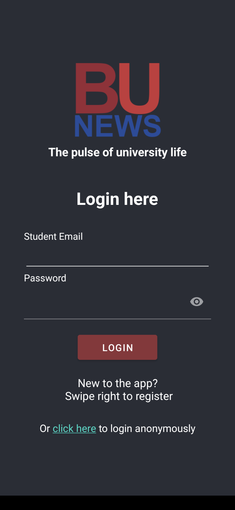
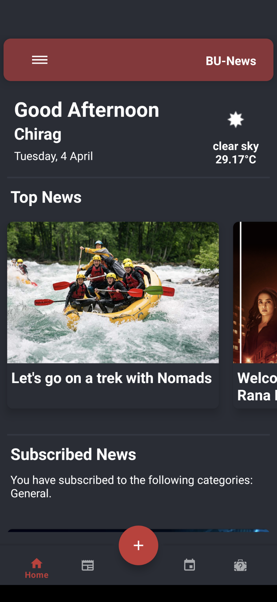
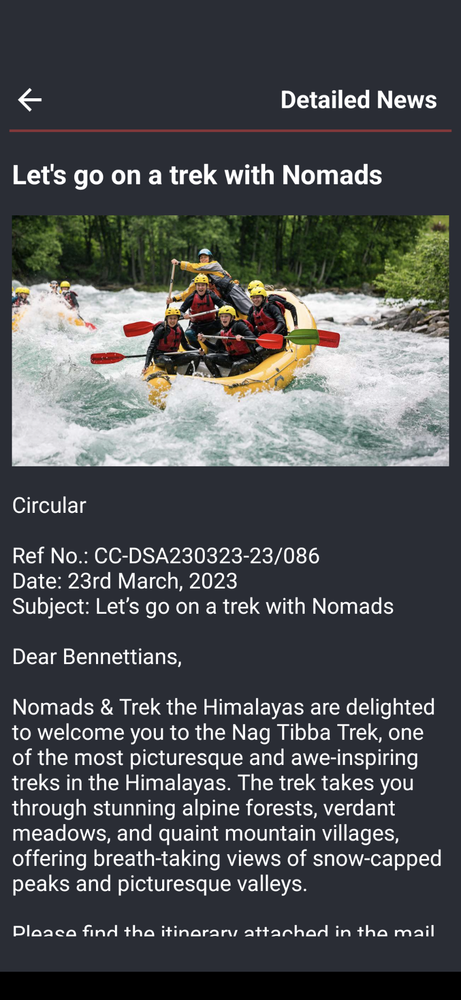

# BU-News-Android 

This Android programme was created with Bennett University students in mind. It offers up-to-date information on events as they are happening in addition to other news items like student accomplishments, newsletters, club registration forms, and much more. It attempts to address the institution's present decentralised news distribution system, which frequently results in issues like news not reaching all students, the proliferation of fake news, or events being pushed by businesses with no connection to the university.

## Install the app

[](https://play.google.com/store/apps/details?id=com.chiragagg5k.bu_news_android)

## Screenshots


|  |  |  |  |
|:--------------------------------------------:|:--------------------------------------------:|:--------------------------------------------:|:--------------------------------------------:|

## Features

- User authentication using email and password
- User profile with profile picture, name, email and phone number 
- Weather info using OpenWeatherMap API
- Subscribe to news categories
- Upload your own news with a 2hr cooldown
- Upload lost and found posts
- Timeline view of upcoming events

## Running from source

1. Clone the repository

```bash
cd {path/to/your/workspace}
git clone https://github.com/ChiragAgg5k/bu-news-android.git
```

2. Open the project in Android Studio
3. Add google-services.json to the app directory (Create a Firebase project and add an Android app to it to get this file)
4. Gradle sync to download dependencies
5. Set up virtual device or connect a physical device
6. Run the app

## Technologies used

- Firebase Authentication, Realtime Database and Storage - https://firebase.google.com/
- CircleImageView - https://github.com/hdodenhof/CircleImageView
- Image Picker - https://github.com/Dhaval2404/ImagePicker
- YoYo Animations - https://github.com/daimajia/AndroidViewAnimations
- Picasso - https://github.com/square/picasso
- OpenWeatherMap API - https://openweathermap.org/api

Please feel free to open an issue if you find any bugs or have any suggestions and don't forget to star the repo if you like it. You can also leave a review on the Play Store.
